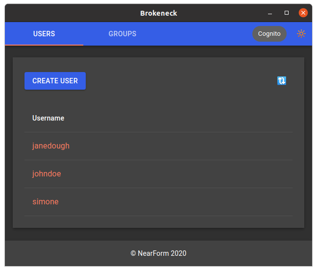

# codename brokeneck

[](https://github.com/nearform/brokeneck/actions?query=workflow%3Aci)
[](https://lerna.js.org/)
[](https://conventionalcommits.org)

This monorepo contains packages and applications which provide a way to manage users and groups in:

- Auth0
- AWS Cognito
- Azure AD



<!-- toc -->

- [Getting started](#getting-started)
- [Development](#development)
- [Providers](#providers)
  * [Auth0](#auth0)
  * [AWS Cognito](#aws-cognito)
  * [Azure AD](#azure-ad)
- [Packages](#packages)
  * [`brokeneck-react`](#brokeneck-react)
  * [`brokeneck-html`](#brokeneck-html)
  * [`brokeneck-fastify`](#brokeneck-fastify)
  * [`brokeneck-desktop`](#brokeneck-desktop)
- [Usage](#usage)
  * [Fully standalone](#fully-standalone)
  * [Separate Web frontend and backend](#separate-web-frontend-and-backend)
  * [As a React component](#as-a-react-component)

<!-- tocstop -->

## Getting started

You'll need yarn and lerna installed globally:

- `npm i -g yarn lerna`

The easiest way to try this out is to run the standalone server via `brokeneck-fastify`:

- `lerna bootstrap`
- `lerna run build`
- `cd packages/brokeneck-fastify`
- `cp .env.sample .env`
- configure `.env` based on the authentication provider you want to use
- `yarn start`
- browse to [`http://localhost:5001`](http://localhost:5001)

## Development

To easily develop the packages of this repo you can execute:

- `cd packages/brokeneck-html`
- `cp .env.sample .env`
- configure `.env` with the correct REACT_APP_API_PATH. The sample one works on the default local install.
- `cd ../../`

Then

```sh
yarn dev
```

This will run:

- `brokeneck-react` build in watch mode so you can change the React components and see the result immediately
- `brokeneck-html` in standalone mode to have a Web UI to access
- `brokeneck-fastify` in standalone mode to have a server running

## Providers

Each provider requires its own configuration, as specified in `brokeneck-fastify`'s `.env.sample` file.

Such configuration can be obtained when configuring the respective service using the provider's usual tooling.

There are additional requirements based on the provider, described in the next sections.

### Auth0

The configured client should be authorized to access the built-in `Auth0 Management API`.

### AWS Cognito

When using AWS cognito you must make sure that you have IAM credentials configured for the SDK in the machine running the application, for instance in the `.aws/credentials` file.

The configured IAM user must have access to Cognito. The simplest way to do this is to add the `AmazonCognitoPowerUser` _AWS managed policy_ to the user.

### Azure AD

The registered application must have all the necessary `Application permissions` (not `Delegated permissions`) to operate on the relevant objects.

These basically include all the combinations of the permissions:

- API: `Azure Active Directory Graph` and `Microsoft Graph`
- Objects: `Directory`, `Users`, `Groups` and `GroupMember`
- Permissions: `Read.All`, `ReadWrite.All`, `Create`,

Not all combinations exists, but you should enabled them when they do.

## Packages

### `brokeneck-react`

A library of React components which provide the UI.

### `brokeneck-html`

This package comes in 2 flavors:

- a standalone CRA application running the UI
- static assets containig the whole UI, which can be rendered by an external application

### `brokeneck-fastify`

This package comes in two flavors:

- a standalone Fastify application
- a Fastify plugin which can be used by an external application

### `brokeneck-desktop`

An Electron application which runs `brokeneck-fastify` with the embedded UI.

## Usage

The packages work in synergy to support different deployment and usage scenarios, described next from the simplest to the most complex and flexible.

> The important thing to keep in mind is that this application requires both a frontend and a backend.

### Fully standalone

If you want to run the application standalone you can use:

- `brokeneck-fastify` in standalone mode and make it render the UI by configuring the application via environment variables
- `brokeneck-desktop` to run the application in desktop mode

### Separate Web frontend and backend

You can run `brokeneck-fastify` in standalone mode without rendering the UI and `brokeneck-html` in standalone mode to provide the UI.

They will be two independent applications.

### As a React component

You can install `brokeneck-react` in your React application and use the exported component.

For example, you can provide it as an additional route inside your application.

You will still need to provide a backend, which you can do either by:

- running `brokeneck-fastify` in standalone mode
- using `brokeneck-fastify` as a plugin inside an existing Fastify application
